# CV @ AV
------
### 2023/5/24

👉 Given by xy

👉 Powered by [reveal.js](https://github.com/hakimel/reveal.js)

Note: Test note.

<!--s-->

# Introduction
------
Overview @ CV @ Autonomous Vehicle

<!--v-->

## Level

|Level|Name|Description|
|:---|:---|:---|
|L0|无自动化|纯人工驾驶，汽车只负责执行命令并不进行驾驶干预|
|L1|驾驶支援|有时能够辅助驾驶员完成某些驾驶任务（eg 车道保持）|
|**L2**|**部分自动化**|**自动系统完成某些驾驶任务，驾驶员需要监控并准备随时接管**|
|L3|有条件自动化|机器可以完成几乎全部的操作，但驾驶员仍需要保持注意力集中以防万一|
|L4|高度自动化|部分场景（城市中或是高速公路）下真正的自动驾驶|
|L5|完全自动化|全场景自动驾驶|

<!--v-->

  https://onlinelibrary.wiley.com/doi/abs/10.1002/rob.20147
   
  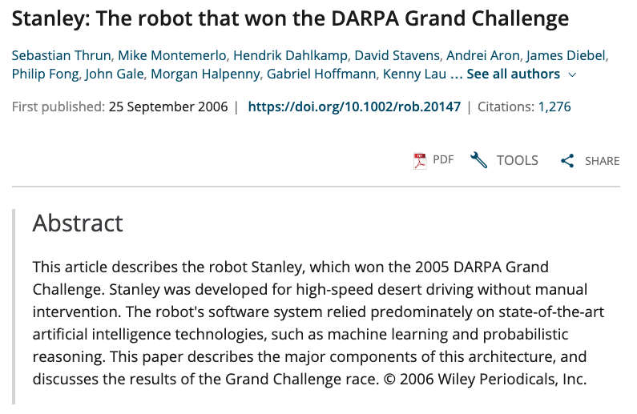

<!--v-->

  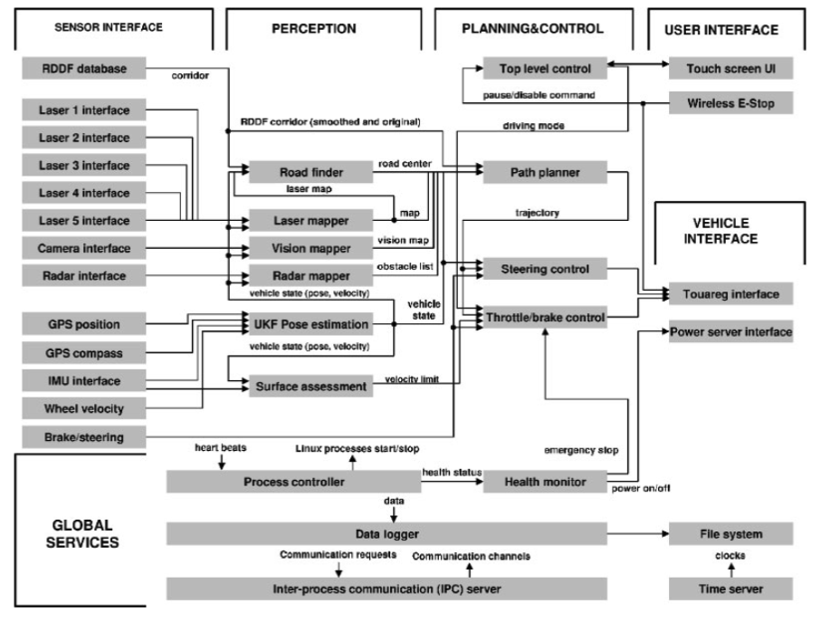

<!--v-->

## 感知、定位、控制

<!--v-->

  https://arxiv.org/abs/2012.03194
   
  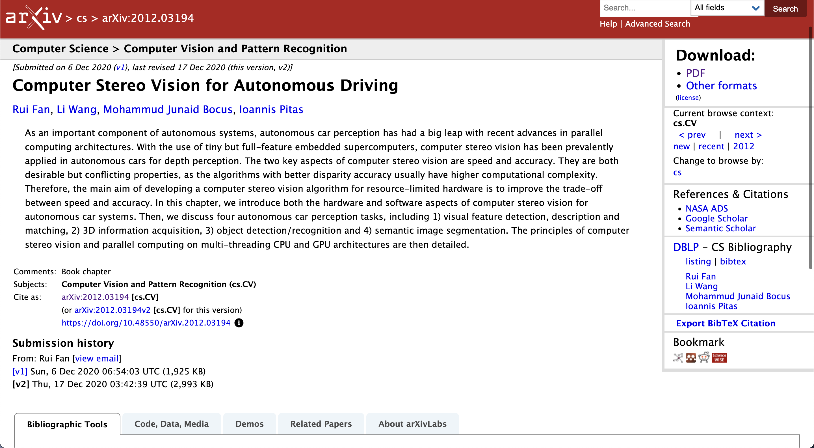

<!--s-->

# Application
------
Role of CV Tech @ AV

<!--v-->
 
## 常见应用

- 目标识别：随航、避障、交通信号...
- 地图构建：SLAM(simultaneous localization and mapping)...

<!--v-->

2D Tech

- 语义分割(Semantic segmentation)
- 对象检测(Object detection)
- 实例分割(Instance segmentation)
- 光流估计(Optical flow estimation)
- ...

3D Tech

- 3D 重建
- 3D 对象检测
- ...

<!--s-->

# CV Tech
------
Simple Knowledge Path

<!--v-->

## Table of content

- 关键点检测（detection）与匹配（matching）
- 深度估计与 3d 重建
- 3D 对象检测与跟踪
- SfM（粗略）[For detail: 🔍](https://note.isshikih.top/cour_note/D2QD_Intro2CV/Lec07/)
- 运动估计

<!--s-->

## detection & matching

<!--v-->

### 怎样的两张图能够被匹配？

<b>关键点(feature points)</b>：独特性 & 对变换不敏感

<!-- .element: class="fragment" -->

- 传统方法：Harris corner detector / Blob detector(LoG or DoG)

- 现代方法：NN！

<!-- .element: class="fragment" -->

<!--v-->

### 哈里斯角点检测器

  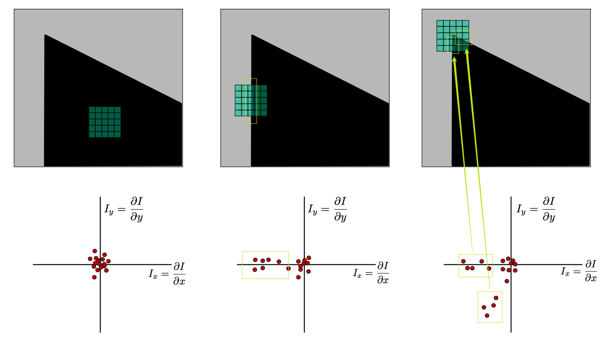

<!--v-->

### 哈里斯角点检测器 (continue)

  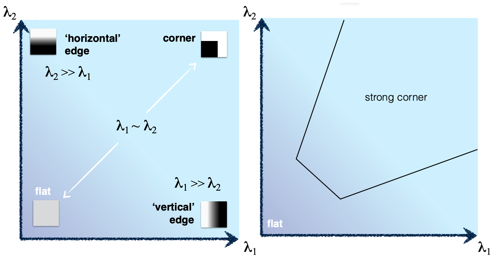

<!--v-->

### 斑点检测器 - LoG 

  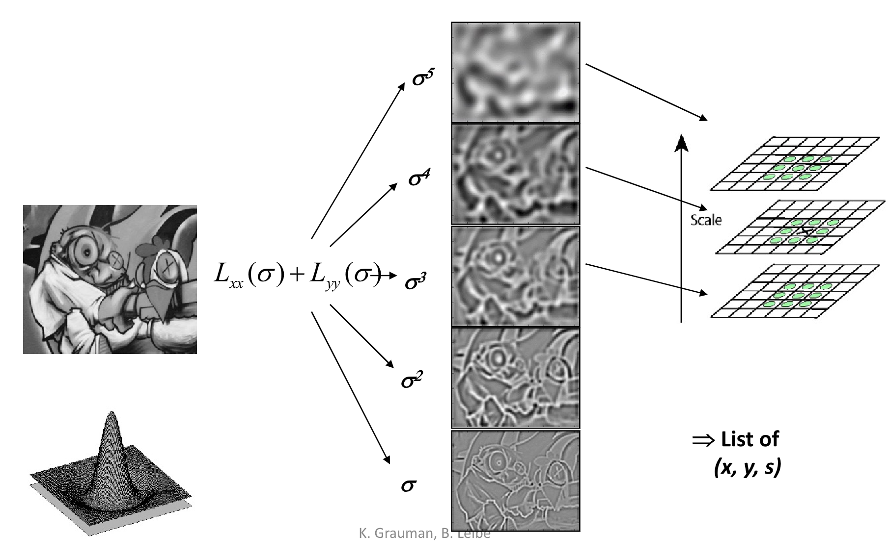

<!--v-->

### 斑点检测器 - DoG

  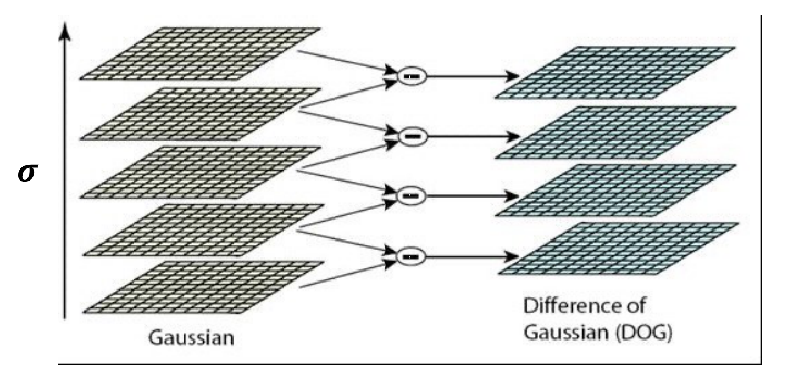

<!--v-->

### 如何表达关键点？

SIFT descriptor

  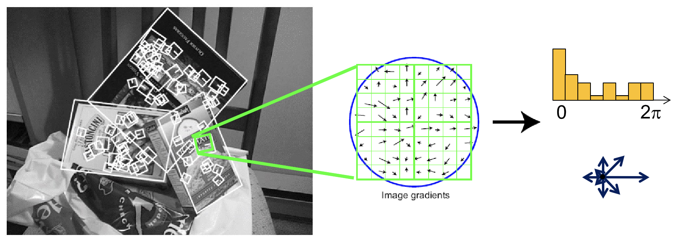

<!-- .element: class="fragment" -->

<!--v-->

### Ex

  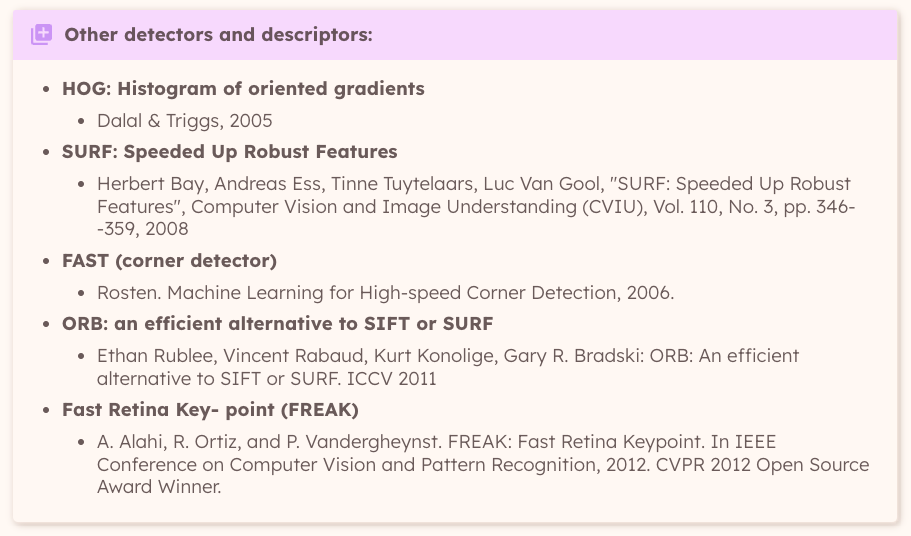

<!--v-->

### 意义

- SfM 的基础
- 视觉定位系统
- ...

<!--s-->

## 深度估计与 3d 重建

基于视觉的 3d 重建主要有两条路径，分别是 SfM 和基于深度估计的，前者前置知识略多，所以我们简单介绍基于深度估计的。

<!--v-->

### 视差

  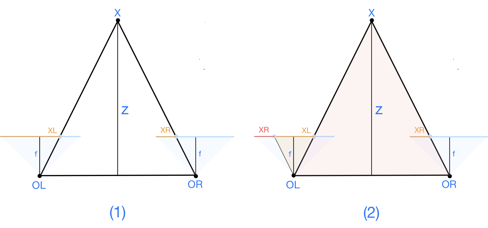

<!--v-->

### 立体影像矫正

  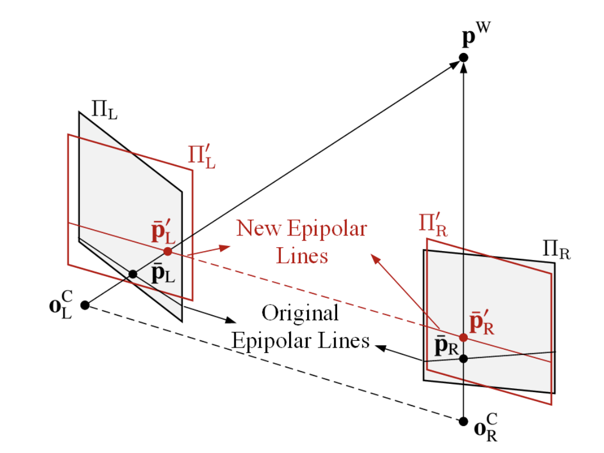

<!--v-->

### 视差 x CNN

  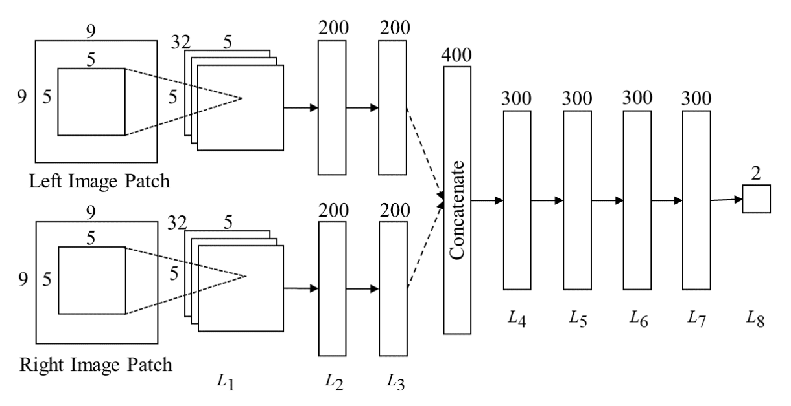

J. Žbontar and Y. LeCun, “Computing the stereo matching cost with a convolutional
neural network,” in Proceedings of the IEEE conference on computer vision and pattern
recognition, 2015, pp. 1592–1599.

<!--v-->

### 意义

- 距离估计

  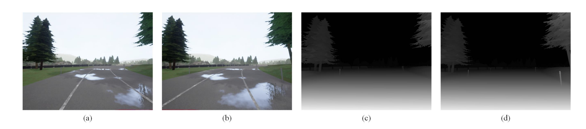

<!-- .element: class="fragment" -->

<!--v-->

### 基于深度的多目重建

- 重投影 & Plane-Sweep：A1 to P to A2

  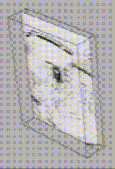

<!--s-->

## 3D 对象检测与跟踪

OnePose: One-Shot Object Pose Estimation without CAD Models
<video data-autoplay src="img/14.mp4" width = 100%></video>

<!--v-->

### Pipeline

  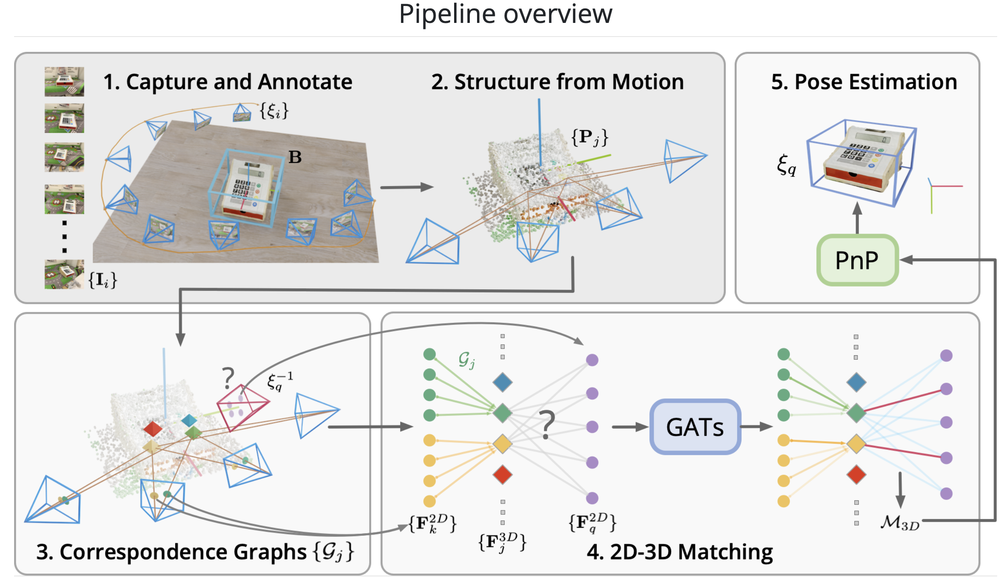

<!--v-->

### 意义

- 随航
- 在检测基础上进行识别、分割

<!--s-->

## SfM

  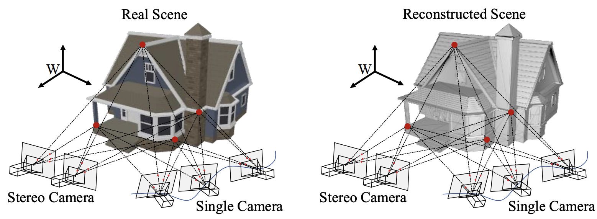

<!--s-->

## 运动估计

无人驾驶场景下，画面变化的可能：

- 你的车动、景不动
- 你的车不动、景动（别的车动、人动、etc）
- 全都在乱动

运动估计：静态 -> 动态

$$
P(x,y,t) \to P(x+u,y+v,t+1)
$$

<!-- .element: class="fragment" -->

常规的解决视角：**特征跟踪**（稀疏）与**光流**（稠密）

<!-- .element: class="fragment" -->

<!--v-->

### LK 假设

1. [Small motion] 相邻帧，匹配点的运动距离小；
2. [Brightness constancy] 相邻帧，点的亮度倾向于不变，即变化微小；
3. [Spatial coherence] 相邻的点倾向于运动相似；

<!--v-->

  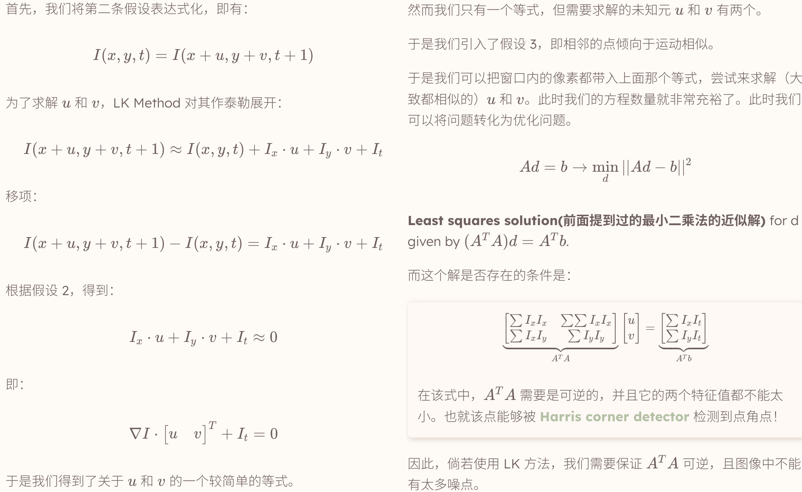

<!--s-->

# 点题
------
~~Digress~~

<!--v-->

## 角色

**传感器** - 控制器 - 执行器

 <!-- .element: class="fragment" -->

<!--v-->

  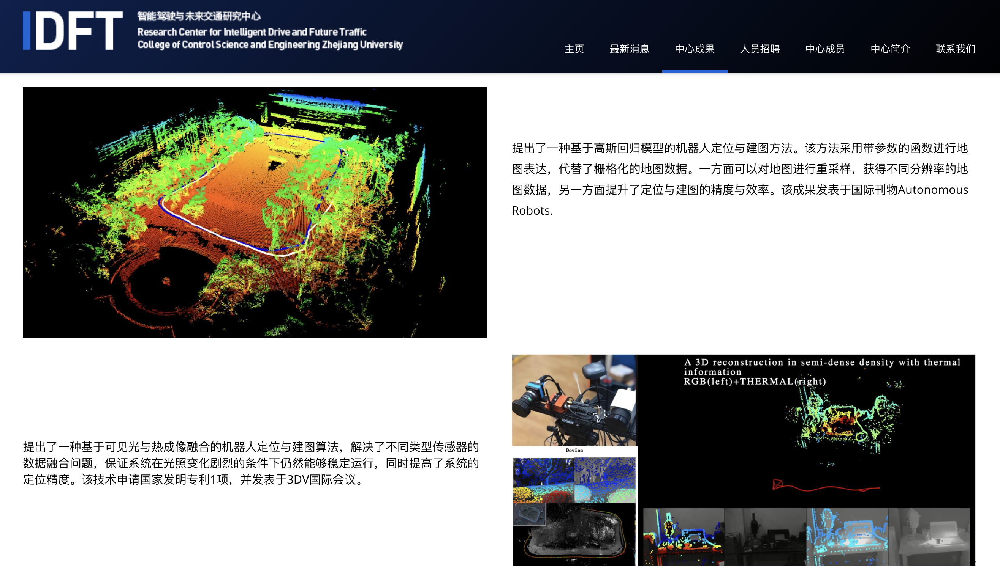

<!--v-->

  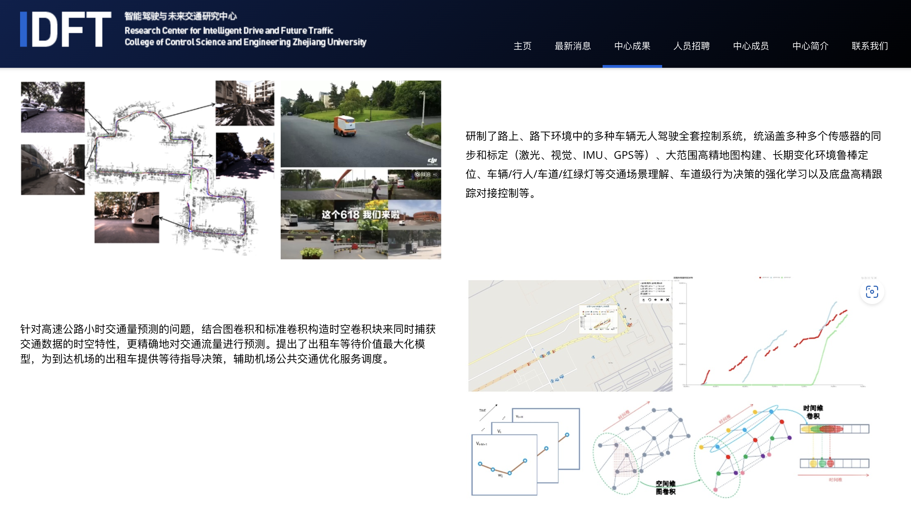

<!--v-->

## 展望

越来越**交叉**、越来越**设计**。

<!--s-->

# Ref

- 张新钰, 高洪波, 赵建辉, 周沫. 基于深度学习的自动驾驶技术综述. 清华大学学报(自然科学版), 2018, 58(4): 438-444.
- Fan R, Wang L, Bocus M J, et al. Computer stereo vision for autonomous driving[J]. arXiv preprint arXiv:2012.03194, 2020.
- Sun J, Wang Z, Zhang S, et al. Onepose: One-shot object pose estimation without cad models[C]//Proceedings of the IEEE/CVF Conference on Computer Vision and Pattern Recognition. 2022: 6825-6834.
- http://idft.zju.edu.cn/中心成果/
- https://note.isshikih.top/cour_note/D2QD_Intro2CV/
